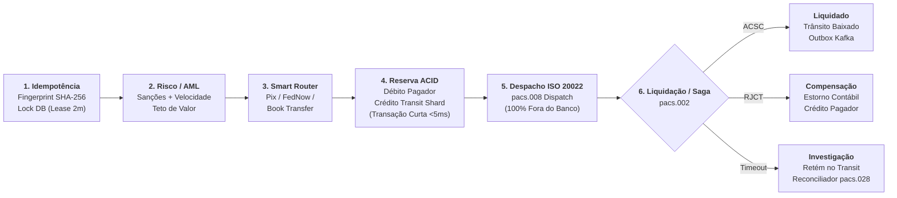

# Nexor RTP Core — Switch de Pagamentos Instantâneos & ISO 20022

> O que acontece quando você conecta o core do seu banco à rede do Banco Central (Pix / FedNow) e a rede externa começa a oscilar? Uma implementação de referência focada em latência, concorrência e resiliência em Java 17 e Spring Boot 3.

[](https://openjdk.org/)
[](https://spring.io/projects/spring-boot)
[](Dockerfile)
[-success.svg)]()
[](https://www.postgresql.org/)
[](https://kafka.apache.org/)
[](LICENSE)

---

## Por que este projeto existe?

Fazer uma transferência bancária interna é trivial: você debita uma conta, credita outra e comita no banco.

A dor de cabeça real começa no segundo em que você precisa plugar essa operação na **câmara compensadora do Banco Central (Bacen SPI no Brasil ou FedNow nos EUA)**:
- Você tem menos de **2.5 segundos** para liquidar a ordem do início ao fim por exigência regulatória.
- A rede do Banco Central é externa: ela pode oscilar, demorar 2 segundos para responder ou simplesmente dar timeout.
- A mensageria segue o padrão estrito **ISO 20022** (`pacs.008` para envio de crédito, `pacs.002` para relatório de status, `pacs.004` para devolução).

Se você tentar resolver isso colocando uma chamada externa dentro de uma anotação `@Transactional` padrão do Spring, o resultado em produção é catastrófico: as conexões do seu pool de banco (**HikariCP**) ficam travadas esperando resposta de rede externa. Quando 100 requisições chegam juntas, o banco de dados inteiro da sua instituição congela.

O **Nexor RTP Core** foi desenhado com Arquitetura Hexagonal (Ports & Adapters) para tratar essa fronteira entre o seu banco e a rede externa de forma cirúrgica.

---

## O Pipeline Transacional



```
                   ┌─────────────────────────────────────────────────────────┐
                   │                 Pipeline de Pagamento                   │
                   └─────────────────────────────────────────────────────────┘
    Idempotência          Esteira de Risco     Roteador         Reserva Contábil         Despacho ISO 20022          Liquidação /
    SHA-256 + Lock DB     Sanções/Velocidade   de Trilhos       (Debita Conta,           (Bacen SPI / FedNow)        Compensação Saga
                                                                Credita Trânsito)
   ┌──────────────┐    ┌──────────────┐    ┌──────────────┐    ┌───────────────────┐    ┌────────────────────┐    ┌─────────────────┐
   │  Fingerprint │───▶│  Sanções     │───▶│  Auto-route  │───▶│ Débito Pagador    │───▶│ pacs.008 Dispatch  │───▶│ ACSC: Liquidado │
   │  Lease de 2m │    │  Velocidade  │    │  Pix/FedNow/ │    │ Crédito Trânsito  │    │ pacs.002 Callback  │    │ RJCT: Estorno   │
   │  Anti-Duplo  │    │  Teto Alto   │    │  Transfer.   │    │ Transação Curta   │    │ Fora do Banco!     │    │ Reserva Contábil│
   └──────────────┘    └──────────────┘    └──────────────┘    └───────────────────┘    └────────────────────┘    └─────────────────┘
```

---

## Decisões de Arquitetura que Evitam Incidentes em Produção

### 1. A Regra de Ouro: Nunca segure conexão de banco esperando rede externa
Se a câmara do Banco Central demorar 1.8 segundos para responder um `pacs.008`, uma transação de banco aberta segurando lock de linha vai derrubar o seu throughput.

No Nexor, o ciclo de vida é fatiado em **3 unidades ACID locais e discretas** via Saga:
- **Fase 1 (Reserva Contábil — < 5ms):** Abre transação no banco, valida o saldo, faz o lock de idempotência e posta os lançamentos de retenção (Débito no Pagador, Crédito na Conta Transitória de Liquidação). Comita imediatamente e devolve a conexão pro HikariCP.
- **Fase 2 (Despacho de Rede ISO 20022):** A chamada de rede externa (`clearingRailPort.dispatchPayment`) executa **100% fora de qualquer transação de banco de dados**. Zero conexões retidas.
- **Fase 3 (Conclusão ou Estorno):** Quando a resposta autoritativa chega, abre-se uma segunda transação relacional curta para efetivar a liquidação ou executar o estorno contábil compensatório.

### 2. Timeout NÃO é Falha: O Perigo do Duplo Crédito
Esse é o erro mais caro que um desenvolvedor júnior pode cometer em pagamentos instantâneos:
> *"A chamada para o Banco Central deu timeout de 2.5s. Vou dar rollback no saldo do meu cliente e devolver o dinheiro para ele."*

**O que acontece na vida real?**
O Banco Central processou e liquidou a ordem 200ms depois do seu timeout. O dinheiro foi para a conta do recebedor no outro banco. Se você estornou o pagador no seu app, a sua instituição acabou de pagar a conta do próprio bolso. Você tomou um **duplo crédito / prejuízo financeiro direto**.

No Nexor:
- Se a rede externa der timeout sem retornar um `pacs.002` definitivo, o status muda para `PENDING_INVESTIGATION`.
- O saldo do cliente continua retido na conta transitória de custódia.
- Um worker assíncrono de reconciliação consulta a câmara compensadora posteriormente antes de tomar qualquer decisão de estorno ou liquidação.

### 3. Idempotência com Fingerprint SHA-256 Real
Não basta olhar se o header `Idempotency-Key` já existe:
- O Nexor calcula um hash SHA-256 determinístico sobre os parâmetros do pagamento (`debtor|creditor|amount|currency|remittance`).
- Se o cliente reenviar a mesma chave com os mesmos dados, recebe a resposta original salva em cache sem reprocessar débito.
- Se o cliente tentar mandar a mesma chave com o **valor alterado** (tentativa de fraude ou bug de payload), o sistema detecta a divergência do fingerprint e rejeita na hora com `HTTP 409 Conflict`.

### 4. Transactional Outbox com `SKIP LOCKED`
- Os eventos de domínio são persistidos na tabela `outbox_events` na mesma transação relacional da reserva contábil.
- Múltiplos pods da aplicação executando em um cluster disputam eventos pendentes usando:
  ```sql
  SELECT * FROM outbox_events 
  WHERE status = 'PENDING' 
  FOR UPDATE SKIP LOCKED 
  LIMIT 50;
  ```
- Cada pod pula os registros que já estão sendo processados por outros pods. Zero contenção de locks e zero duplicação de mensagens publicadas no Kafka.

---

## Desafios Reais de Escala em Redes Centralizadas

### A. O Gargalo da Conta Transitória Única (Transit Account Hotspot)
Em produção, sob 5.000 transferências por segundo, cada pagamento em voo credita a conta de liquidação do Banco Central (`TRANSIT-001`). Se você usar lock pessimista (`FOR UPDATE`) ou otimista (`@Version`) em uma **única linha de banco**, você acabou de transformar seu sistema concorrente em uma fila indiana serializada.

**Como resolvemos na prática:**
- **Sharded Transit Buckets:** A liquidação transitória é particionada deterministicamente em 16 sub-contas (`TRANSIT-001` até `TRANSIT-016`) distribuídas pelo hash do ID da transação (`Math.abs(txId.hashCode()) % 16 + 1`).
- Cada pagamento bate em um bucket diferente com concorrência limpa, eliminando contenção de locks de banco sob milhares de transações simultâneas, mantendo consistência contábil estrita e estorno determinístico.

### B. Callbacks ISO 20022 que Chegam Fora de Ordem
No mundo real, o Banco Central responde via webhook assíncrono. Em condições de jitter de rede, o callback `pacs.002` pode bater em um dos nós do seu cluster **antes** mesmo da thread que despachou o `pacs.008` ter concluído o commit do estado inicial no banco de dados.

**Como resolvemos conceitualmente:**
- **Staging Lease Buffer:** Quando o callback chega para um `EndToEndId` ainda não visível no estado de despacho, ele não quebra com `404 Not Found`. Ele é retido em um buffer efêmero de quarentena com retentativa curta (250ms com jitter) até correlacionar o registro original de forma atômica.

---

## Estrutura do Projeto (Hexagonal Pura)

```text
com.nexor.payments/
├── domain/                      # Regras de negócio puras (zero dependência de Spring/JPA)
│   ├── model/                  # Money, PaymentInstruction, PaymentStatus, EndToEndId
│   ├── ledger/                 # LedgerAccount, JournalEntry, PostingLeg, AccountType
│   ├── iso20022/               # Modelos oficiais ISO: pacs.008, pacs.002, pacs.004
│   └── exception/              # InsufficientFundsException, FraudRejectionException
├── application/                # Casos de uso e orquestração de saga
│   ├── port/in/                # SubmitPaymentUseCase e DTOs de comando
│   ├── port/out/               # Portas de saída (ClearingRailPort, LedgerRepositoryPort, etc.)
│   ├── saga/                   # PaymentSagaOrchestrator (orquestrador com ACID escopado)
│   ├── ledger/                 # LedgerIntegrityService (auditoria histórica de lançamentos)
│   └── fraud/                  # FraudScreeningChain (sanções, velocidade e teto)
└── infrastructure/             # Adaptadores de tecnologia externa
    ├── adapter/in/web/         # REST Controller (/api/v1/payments) e handlers
    ├── adapter/out/persistence/# Entidades JPA, repositórios e outbox
    ├── adapter/out/messaging/  # OutboxRelayWorker (publicação assíncrona Kafka)
    ├── adapter/out/clearing/   # Adaptador de mock do trilho e worker de reconciliação
    └── config/                 # Filtros de segurança e rate limiting
```

---

## Documentação de Engenharia, Diagramas & ADRs

O ecossistema do Nexor RTP Core possui documentação técnica detalhada, diagramas C4 interativos e registros formais de decisões de arquitetura:

* 📐 **[Diagramas de Arquitetura & Sequência (docs/ARCHITECTURE_DIAGRAMS.md)](docs/ARCHITECTURE_DIAGRAMS.md):**
  - **C4 Nível 1 (System Context):** Integração com SPI/FedNow, Kafka e clientes bancários.
  - **C4 Nível 2 (Containers):** Separação entre Web API, PostgreSQL, Outbox Relay e Reconciliador.
  - **C4 Nível 3 (Componentes Hexagonais):** Camadas de Domínio, Portas de Entrada/Saída e Adaptadores.
  - **Máquina de Estados de Pagamento (FSM):** Transições formais (`VALIDATED` $\rightarrow$ `FUNDS_RESERVED` $\rightarrow$ `SETTLED` / `PENDING_INVESTIGATION` / `COMPENSATED`).
  - **Sequência Transactional Outbox:** Persistência atômica com `SKIP LOCKED` e tolerância a falhas no Kafka.
  - **Sequência do Reconciliador:** Ciclo de auditoria assíncrona fora da transação relacional.
  - **Sharded Transit Buckets:** Particionamento anti-hotspot em 16 shards para 5.000+ TPS.
  - **Correlacionador Assíncrono:** Tratamento de callbacks `pacs.002` fora de ordem via staging lease buffer.

* 🏗️ **[Blueprint de Produção & Nuvem (docs/PRODUCTION_BLUEPRINT.md)](docs/PRODUCTION_BLUEPRINT.md):**
  - Topologia de referência AWS Multi-AZ (EKS, Aurora PostgreSQL Multi-AZ, Amazon MSK).
  - Matriz de Prontidão Operacional cobrindo 20 dimensões de missão crítica (Zero Trust, mTLS, Debezium CDC, RPO=0 / RTO < 30s).

* 📜 **[Architecture Decision Records — ADRs (docs/adr/)](docs/adr/):**
  - [ADR-001](docs/adr/ADR-001-hexagonal-architecture.md): Arquitetura Hexagonal e Isolamento Limpo de Domínio
  - [ADR-002](docs/adr/ADR-002-double-entry-ledger-invariants.md): Livro-Razão de Partidas Dobradas e Invariante de Soma Zero
  - [ADR-003](docs/adr/ADR-003-distributed-idempotency-sha256.md): Idempotência com Fingerprint Determinístico SHA-256
  - [ADR-004](docs/adr/ADR-004-transactional-outbox-skip-locked.md): Transactional Outbox com `FOR UPDATE SKIP LOCKED`
  - [ADR-005](docs/adr/ADR-005-timeout-is-not-failure.md): Timeout Não é Falha (Reconciliação Assíncrona contra Duplo Crédito)
  - [ADR-006](docs/adr/ADR-006-scoped-acid-boundaries-saga.md): Fronteiras ACID Escopadas no Saga Orquestrador
  - [ADR-007](docs/adr/ADR-007-rate-limiting-strategy.md): Rate Limiting com Evicção Ativa de Memória
  - [ADR-008](docs/adr/ADR-008-optimistic-vs-pessimistic-locking.md): Lock Otimista vs Pessimista em Contas Contábeis
  - [ADR-009](docs/adr/ADR-009-security-model.md): Modelo de Segurança (API Key + RBAC)
  - [ADR-010](docs/adr/ADR-010-sharded-transit-buckets.md): Sharded Transit Buckets para Eliminação de Gargalo Central

---

## Como Rodar e Testar

### 1. Rodar os Testes Unitários e de Concorrência
```bash
mvn clean test
```

### 2. Rodar o Teste de Estresse Multi-Processo Real
Temos um teste de integração de ponta a ponta que compila o JAR e **sobe 3 processos de sistema operacional distintos** (3 instâncias JVM reais em portas diferentes), disparando requisições com a mesma chave de idempotência concorrentemente contra o PostgreSQL para provar que nunca ocorre débito duplicado:

```bash
mvn clean package -DskipTests
mvn failsafe:integration-test failsafe:verify
```

---

## Licença

Distribuído sob a licença [MIT](LICENSE).
