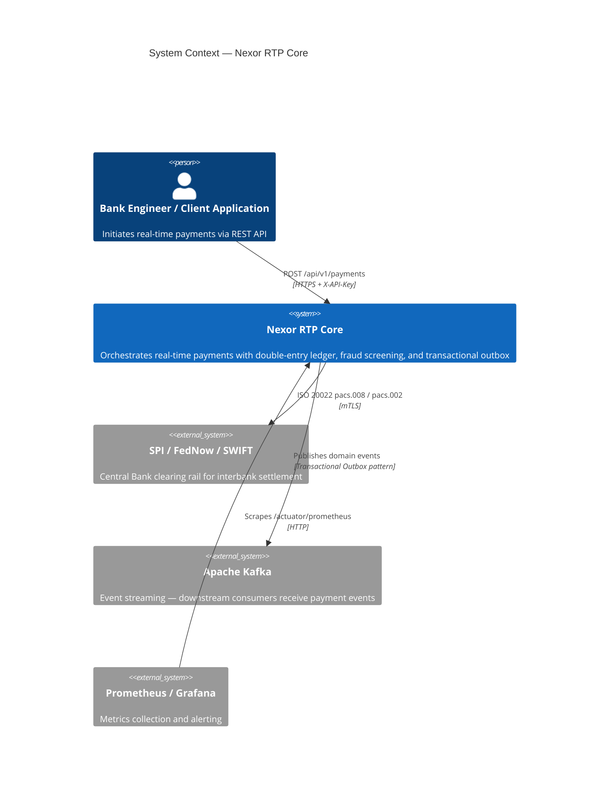
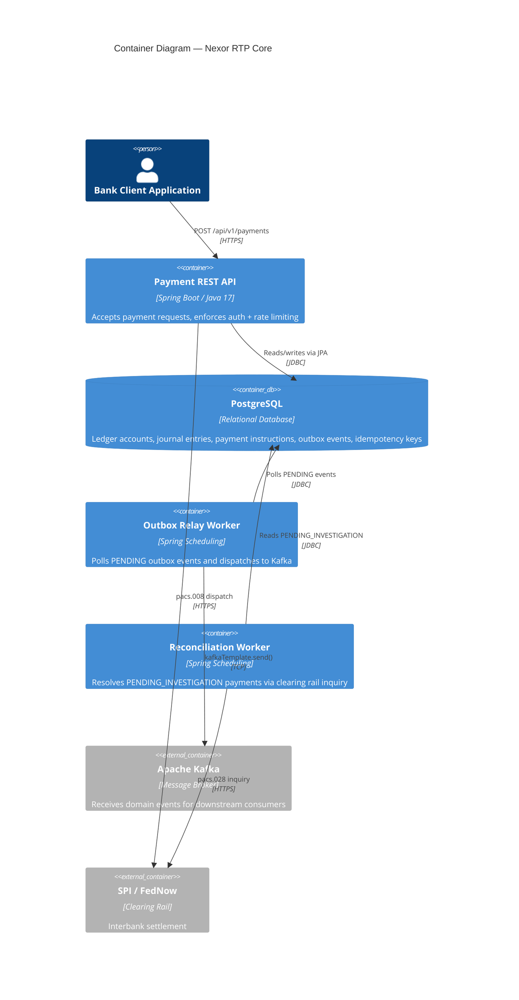
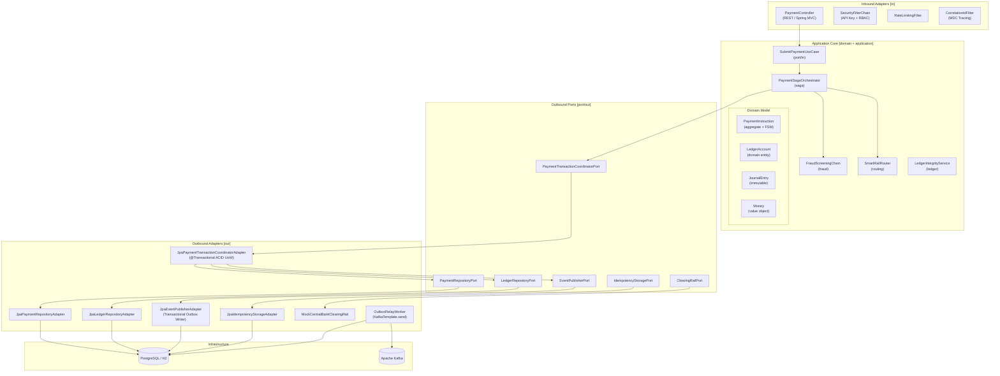
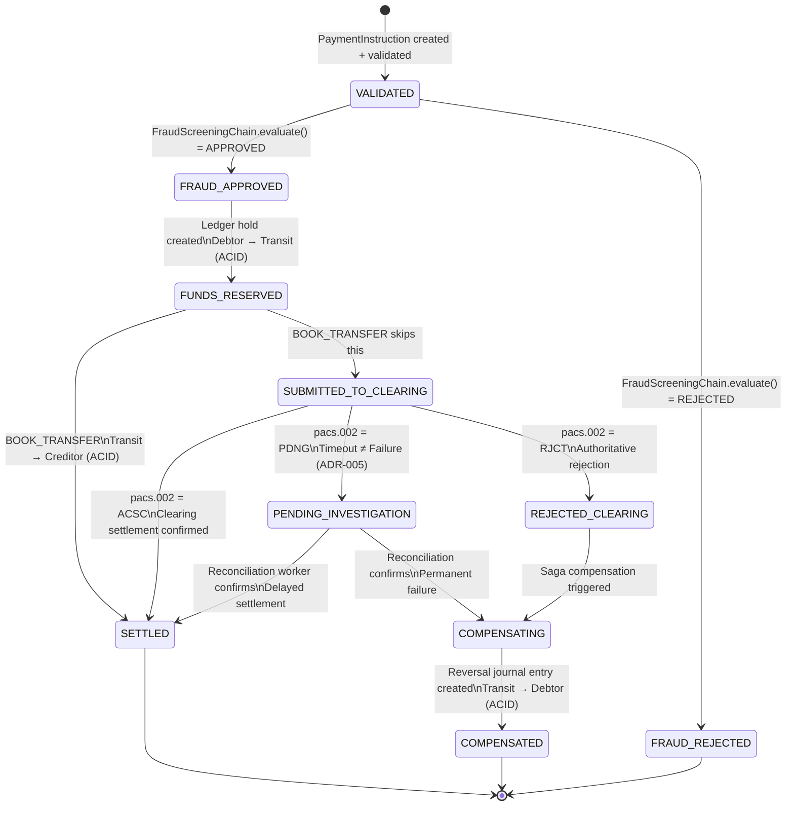
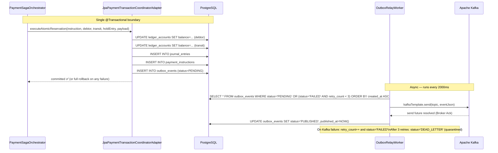
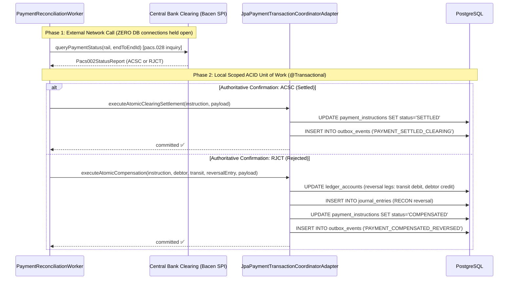
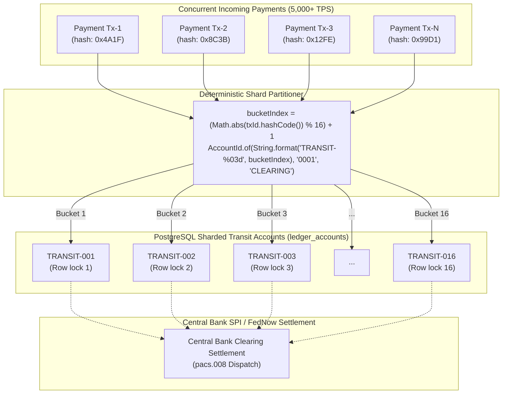
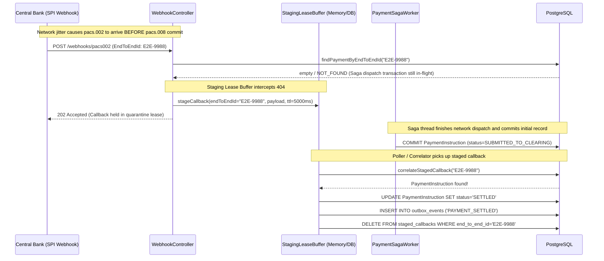

# Nexor RTP Core — Architecture Diagrams

## C4 Level 1 — System Context

---

## C4 Level 2 — Container Diagram

---

## C4 Level 3 — Component Diagram (Hexagonal Architecture)

---

## Payment State Machine

> **Note on PENDING_INVESTIGATION:** A clearing timeout does NOT trigger automatic compensation.
> Funds remain in the transit buffer pending async reconciliation inquiry (pacs.028).
> This is the correct behavior per ISO 20022 and ADR-005. Premature compensation on timeout
> would result in double-refunds when the clearing rail eventually confirms settlement.

---

## Transactional Outbox Flow

---

## Reconciliation Worker Flow (ADR-006: Scoped ACID Boundaries)

---

## Sharded Transit Buckets — Concurrency & Hotspot Elimination (ADR-010)

---

## Asynchronous Callback Race Condition Handling (Staging Lease Buffer)

